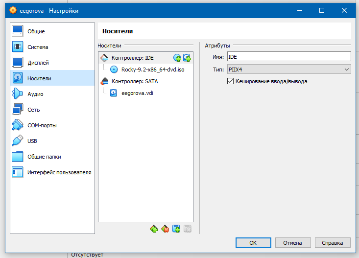

---
# Front matter
lang: ru-RU
title: "Отчёт по лабораторной работе №1"
subtitle: "Развертывание виртуальной машины"
author: "Екатерина Егорова"

# Formatting
toc-title: "Содержание"
toc: true # Table of contents
toc_depth: 2
lof: true # List of figures
fontsize: 12pt
linestretch: 1.5
papersize: a4paper
documentclass: scrreprt
polyglossia-lang: russian
polyglossia-otherlangs: english
mainfont: PT Serif
romanfont: PT Serif
sansfont: PT Sans
monofont: PT Mono
mainfontoptions: Ligatures=TeX
romanfontoptions: Ligatures=TeX
sansfontoptions: Ligatures=TeX,Scale=MatchLowercase
monofontoptions: Scale=MatchLowercase
indent: true
pdf-engine: lualatex
header-includes:
  - \linepenalty=10 # the penalty added to the badness of each line within a paragraph (no associated penalty node) Increasing the value makes tex try to have fewer lines in the paragraph.
  - \interlinepenalty=0 # value of the penalty (node) added after each line of a paragraph.
  - \hyphenpenalty=50 # the penalty for line breaking at an automatically inserted hyphen
  - \exhyphenpenalty=50 # the penalty for line breaking at an explicit hyphen
  - \binoppenalty=700 # the penalty for breaking a line at a binary operator
  - \relpenalty=500 # the penalty for breaking a line at a relation
  - \clubpenalty=150 # extra penalty for breaking after first line of a paragraph
  - \widowpenalty=150 # extra penalty for breaking before last line of a paragraph
  - \displaywidowpenalty=50 # extra penalty for breaking before last line before a display math
  - \brokenpenalty=100 # extra penalty for page breaking after a hyphenated line
  - \predisplaypenalty=10000 # penalty for breaking before a display
  - \postdisplaypenalty=0 # penalty for breaking after a display
  - \floatingpenalty = 20000 # penalty for splitting an insertion (can only be split footnote in standard LaTeX)
  - \raggedbottom # or \flushbottom
  - \usepackage{float} # keep figures where there are in the text
  - \floatplacement{figure}{H} # keep figures where there are in the text
---

# Цель работы

Целью данной работы является приобретение практических навыков установки операционной системы на виртуальную машину, размещение файлов на сервисе Git и подготовка отчета в формате Markdown.

# Выполнение лабораторной работы

Создаю виртуальную машину

{ #fig:001 width=70% height=70% }

Задаю конфигурацию жёсткого диска — VDI, динамический виртуальный диск.

{ #fig:002 width=70% height=70% }

{ #fig:003 width=70% height=70% }

Добавляю новый привод оптических дисков и выбираю образ 

{ #fig:004 width=70% height=70% }

Запускаю виртуальную машину и выбираю установку системы на жёсткий диск.
Устанавливаю язык для интерфейса и раскладки клавиатуры

{ #fig:005 width=70% height=70% }

Указываю параметры установки

{ #fig:006 width=70% height=70% }
 
Перехожу к этапу установки и дожидаюсь его завершения.

{ #fig:007 width=70% height=70% }

{ #fig:008 width=70% height=70% }

Загружаю с жесткого диска установленную систему

{ #fig:009 width=70% height=70% }

# Вывод

Мы приобрели практические навыки установки операционной системы на виртуальную машину, Целью данной работы является приобретение практических навыков установки операционной системы на виртуальную машину, разместили файлы работы на сервисе Git и подготовили отчет в формате Markdown.
# Ответы на контрольные вопросы

1.  Идентификационные данные, права доступа, дополнительная информация, cистемная информация.
2. Получение справки по команде:
* man <команда> -  отображает страницу руководства по команде.
* help <команда> -  отображает краткую справку по команде (не для всех команд).
* info <команда> -  предоставляет более подробную информацию, чем man.
 Перемещение по файловой системе:
* cd <путь> -  переход в указанный каталог.
* cd .. -  переход в родительский каталог.
* cd ~ -  переход в домашний каталог.
Просмотр содержимого каталога:

* ls -  отображает содержимое текущего каталога.
* ls -l -  отображает подробную информацию о файлах (права доступа, размер, дата изменения и т.д.).
* ls -a -  отображает все файлы, включая скрытые.
Определение объёма каталога:
* du -sh <каталог> -  отображает размер каталога в человекочитаемом формате. Создание / удаление каталогов / файлов:
* mkdir <каталог> -  создание каталога.
* rmdir <каталог> -  удаление пустого каталога.
* touch <файл> -  создание файла (пустого).
* rm <файл> -  удаление файла.
Задание определённых прав на файл / каталог:
* chmod <права> <файл> -  изменение прав доступа к файлу.
* chown <владелец>:<группа> <файл> -  изменение владельца и группы файла.
Задание определённых прав на файл / каталог:
* chmod <права> <файл> -  изменение прав доступа к файлу.
* chown <владелец>:<группа> <файл> -  изменение владельца и группы файла.
3. Файловая система – это способ организации данных на диске, предоставляющий структуру для хранения и поиска файлов. Она определяет, как информация структурирована, как к ней обращаются, и какие операции доступны.
Ext4:Cтандартная файловая система для большинства дистрибутивов Linux.
4. Чтобы посмотреть, какие файловые системы подмонтированы в ОС Linux, используйте команду mount
5. Найти PID,далее использовать команду `kill -9`.

